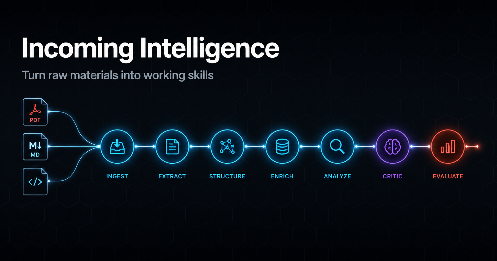

[](LICENSE)
[](#)
[](https://python.org)

# Incoming Intelligence

**Stop letting good materials rot in folders. Turn them into working skills in one pass.**

## The Problem

You attend webinars, follow channels, take courses. You collect PDFs, code snippets, skill files, guides - and dump them into a folder. Then:

1. **You forget what's in there.** The folder grows, you never look back.
2. **You don't know what's useful.** Half is noise, half is gold - but which half?
3. **You already have tools that cover it** - but you don't check before reinventing.
4. **Good materials never become part of your workflow.** They stay as files, not skills.

## The Solution

Point Claude Code at any folder. Get a structured report. Approve. Done.

```
You: "Process the folder ~/Downloads/webinar-materials"

Incoming Intelligence:
========================================
INCOMING INTEL: webinar-materials
Files: 12 | Useful: 5 | Skip: 7
========================================
TAKE:
1. video-montage -> NEW_SKILL
   Full video editing pipeline for reels
   Critic: AGREE - no equivalent exists

ENHANCE:
2. prompt-tips.pdf -> ENHANCE prompt-engineer
   Adds step-back prompting technique
   Critic: AGREE - worth adding

SKIP:
3. remote-control.md - macOS only, we're on Windows
========================================
Approve? [yes/selective/no]
```

## How It Works

A 7-step pipeline with built-in adversarial review:

| Step | What | Model | Cost |
|------|------|-------|------|
| 1. Scan | Build file manifest | - | free |
| 2. Extract | Read all files in parallel | haiku | low |
| 3. Context | Check existing skills for overlap | sonnet | medium |
| 4. Evaluate | Rate usefulness, quality, safety | sonnet | medium |
| 5. Critic | Independent adversarial review | sonnet | medium |
| 6. Report | Present findings to human | sonnet | low |
| 7. Integrate | Create/update skills after approval | sonnet | medium |

**Key design decisions:**
- Haiku for bulk file reading (cheap), Sonnet for decisions (accurate)
- Critic does NOT see evaluator's reasoning - truly independent
- Human approves before ANY changes are made
- Checks your existing skills/knowledge before recommending new ones

## Supported File Types

| Type | Extensions | How it's read |
|------|-----------|---------------|
| Text | .md, .txt, .rtf | Direct read |
| PDF | .pdf | pdfminer (UTF-8) |
| Images | .png, .jpg, .webp | Claude Vision |
| Code | .py, .js, .ts, .sh | Direct read + security scan |
| Skills | SKILL.md, .skill | Frontmatter + content analysis |
| Office | .docx, .xlsx, .pptx | python-docx/openpyxl |
| Archives | .zip, .tar.gz | Unpack, then recurse |
| Config | .json, .yaml, .toml | Direct read |

## Categories

Each artifact gets classified:

| Category | Meaning | Action |
|----------|---------|--------|
| `NEW_SKILL` | Nothing like it exists | Create new skill |
| `ENHANCE` | Improves an existing skill | Update existing SKILL.md |
| `APPROACH` | Changes a workflow | Update config/memory |
| `VAULT_FILE` | Useful for a project | Distribute to project folder |
| `REFERENCE` | Good reference material | Save in knowledge base |
| `DISCARD` | Not useful | Skip with explanation |

## Quick Start

```bash
# 1. Clone
git clone https://github.com/Evgeniy-Mikhailove/incoming-intel.git

# 2. Copy to your skills
mkdir -p ~/.claude/skills/incoming-intel
cp incoming-intel/SKILL.md ~/.claude/skills/incoming-intel/

# 3. Install PDF support (optional)
pip install pdfminer.six

# 4. Use
# In Claude Code, point at any folder:
# "Process the folder ~/Downloads/course-materials"
```

## The Adversarial Critic

Most AI workflows rubber-stamp their own recommendations. This one doesn't.

The **Critic** is a separate agent that:
- Does NOT see the Evaluator's reasoning
- Only sees: raw files + recommendation list
- Can flip any TAKE to SKIP (and vice versa)
- Asks hard questions: "Is this really not a duplicate?" "Is this code safe?"
- On disagreement, both opinions go to the human

This catches overconfident recommendations and hidden duplicates.

## Vault Distribution (Optional)

If you maintain a structured knowledge base (Obsidian vault, project folders), the skill can also distribute files to the right locations - not just create skills.

Activate by pointing at your inbox folder. The skill maps each file to:
- Project folders (active projects get relevant materials)
- Knowledge sections (methodologies, techniques)
- Skill directory (tools and automations)

## Requirements

- **Claude Code** with Agent tool support
- **Python 3.9+** with `pdfminer.six` (for PDF reading)
- **graphify** (optional - for knowledge graph overlap detection)

## License

Apache 2.0 - see [LICENSE](LICENSE).

## Related

- [skill-lifecycle](https://github.com/Evgeniy-Mikhailove/skill-lifecycle) - Manage hundreds of Claude Code skills
